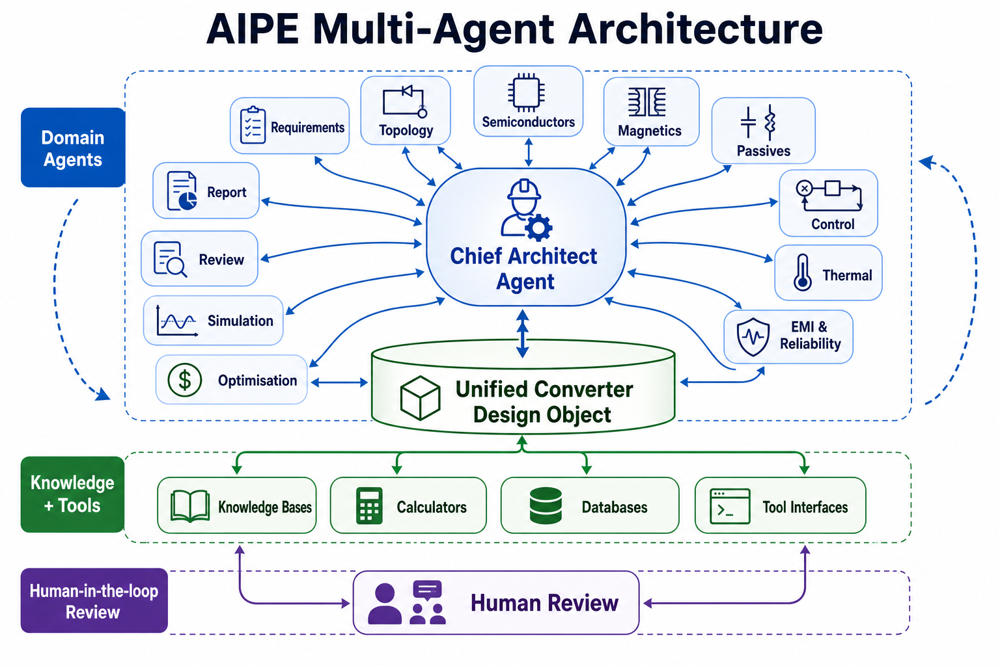
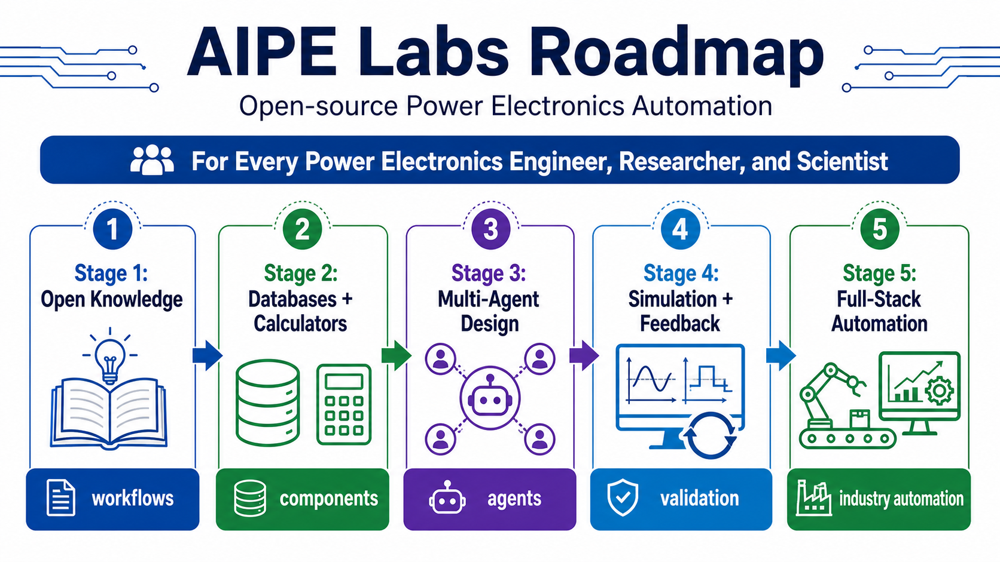

# AIPE Labs

**AIPE Labs is an open-source community for AI-assisted power electronics automation.**

Our vision is to make advanced power electronics design, simulation, optimisation, documentation, and validation more automated, traceable, reusable, and accessible for every power electronics engineer, researcher, and scientist.

Power electronics is becoming too multidisciplinary for fragmented manual workflows alone. Converter design now requires coordinated decisions across topology, semiconductor devices, magnetics, capacitors, control, thermal management, EMI, reliability, manufacturability, cost, simulation, testing, and lifecycle feedback. AIPE exists to build the open architecture, tools, datasets, agents, and workflows needed to automate as much of this engineering process as possible.

## Mission

AIPE means **AI for Power Electronics**.

The long-term mission is not only to build a single design assistant. The mission is to help the power electronics community move toward a more automated engineering ecosystem:

- from natural-language requirements to structured converter specifications
- from specifications to topology and architecture exploration
- from topology to device, magnetics, passive, control, and thermal design
- from design candidates to multi-objective optimisation and Pareto comparison
- from calculations to simulation-ready models and validation plans
- from project experience to reusable open knowledge, databases, and AI workflows
- from isolated tools to a community-driven automation framework for the whole field

AIPE is designed to augment engineers, not replace engineering judgement. Human experts remain responsible for assumptions, safety margins, model validity, hardware review, and final design approval. The role of AIPE is to automate repetitive exploration, preserve design rationale, expose trade-offs, and make expert workflows reusable.

## Why AIPE

Power electronic converter design is still scattered across datasheets, empirical rules, spreadsheets, analytical models, simulation tools, laboratory notes, and personal experience. This makes it difficult to explore large design spaces, compare alternatives transparently, and reuse knowledge across projects.

AIPE addresses this by combining:

- LLM-based reasoning and workflow coordination
- deterministic engineering calculators
- curated component and material databases
- rule-based safety and derating checks
- optimisation routines
- simulation and tool-chain interfaces
- human-in-the-loop engineering review
- open-source community knowledge

The objective is to create a practical bridge between power electronics domain expertise and agentic engineering software.

## Architecture

The AIPE framework is organised as a multi-agent engineering workflow.

At the centre is a **Chief Architect Agent**. It interprets the design intent, selects the workflow, coordinates domain agents, manages assumptions, detects conflicts, and decides whether a design should proceed, iterate, or be rejected.

Around it are specialised domain agents:

| Agent | Responsibility |
| --- | --- |
| Requirement Agent | Converts natural-language prompts and partial specifications into structured requirements. |
| Topology Agent | Generates, ranks, and rejects converter topology candidates with engineering reasoning. |
| Design Variable Agent | Defines feasible search bounds for frequency, voltage ratio, ripple, resonant parameters, and related variables. |
| Semiconductor Agent | Selects Si, SiC, and GaN devices and estimates conduction, switching, and thermal risks. |
| Magnetics Agent | Designs inductors and transformers, including core choice, winding, loss, saturation, and manufacturability. |
| Passive Agent | Sizes DC-link, input, output, resonant, snubber, and EMI-related passive components. |
| Control Agent | Proposes modulation, control loops, sensing, protection, and digital implementation logic. |
| Thermal Agent | Converts loss distribution into temperature estimates and cooling requirements. |
| EMI and Reliability Agent | Identifies EMI risks, derating issues, failure modes, and safety concerns. |
| Cost and Supply Agent | Estimates BOM cost, alternative parts, and supply-chain risk. |
| Optimisation Agent | Performs constrained multi-objective optimisation and Pareto ranking. |
| Simulation Agent | Generates simulation plans, parameter sets, and tool-ready workflows. |
| Review Agent | Performs senior-engineer-style sanity checking before a design is accepted. |
| Report Agent | Produces reports, comparison tables, risk registers, BOMs, and documentation. |

## Unified Design Object

A core AIPE idea is that all agents should work on a shared structured design state rather than producing isolated outputs.

The **Unified Converter Design Object** records:

- requirements and assumptions
- topology candidates and rejected options
- selected topology and design variables
- semiconductor, magnetics, passive, and cooling candidates
- losses, thermal results, EMI risks, reliability risks, and cost estimates
- optimisation results and Pareto comparisons
- simulation plans and validation requirements
- review warnings and human decisions
- design history and reasons for each iteration

This shared object makes the workflow traceable. For example, if a lower switching frequency reduces switching loss but increases magnetic volume, the trade-off should be recorded explicitly instead of disappearing inside an optimisation result.

## Workflow Logic

AIPE follows an iterative state-based workflow:

1. Parse requirements and identify missing information.
2. Generate candidate converter architectures.
3. Define design variables and feasible search boundaries.
4. Select devices, magnetics, passives, control methods, and cooling assumptions.
5. Run deterministic calculations and rule-based checks.
6. Compare candidates by efficiency, volume, cost, temperature, EMI risk, reliability, and manufacturability.
7. Resolve conflicts through optimisation, review, and human judgement.
8. Generate simulation-ready models, validation plans, and engineering reports.
9. Feed review results and test knowledge back into the design object and community knowledge base.

The aim is not to hide engineering compromises behind one automatically generated answer. AIPE should expose why each candidate works, why another candidate was rejected, and what must be validated next.

## Open-Source Community

AIPE Labs is built as an open-source community because power electronics automation is bigger than one person, one lab, or one company.

The community welcomes:

- power electronics engineers
- researchers and PhD students
- semiconductor and magnetics specialists
- control and simulation experts
- AI agent and software developers
- educators building reusable engineering workflows
- scientists working on automated design and optimisation

The shared goal is ambitious: to maximise automation across the power electronics industry while keeping engineering decisions transparent, auditable, and physically grounded.

## Roadmap

### Stage 1: Open Knowledge and Reusable Workflows

- Collect topology knowledge, design rules, and reference workflows.
- Build reusable simulation and debugging skills for PLECS, LTspice, SIMetrix/SIMPLIS, MATLAB/Simulink, ANSYS, and COMSOL.
- Organise power electronics research-writing and documentation workflows.
- Publish examples that show how AI agents can assist real converter projects.

### Stage 2: Structured Databases and Deterministic Calculators

- Develop semiconductor, magnetic material, passive component, and cooling databases.
- Build loss, thermal, derating, ripple, magnetics, and cost calculators.
- Link every recommendation to data, assumptions, and engineering rules.
- Support traceable early-stage screening before high-fidelity simulation.

### Stage 3: Multi-Agent Converter Design Automation

- Implement requirement, topology, semiconductor, magnetics, passive, control, thermal, EMI, reliability, cost, optimisation, simulation, review, and report agents.
- Use a shared converter design object to coordinate all agents.
- Support DC-DC, AC-DC, DC-AC, AC-AC, isolated, bidirectional, and grid-connected converter workflows.
- Generate simulation-ready candidate designs and validation plans.

### Stage 4: Optimisation, Simulation, and Experimental Feedback

- Integrate Pareto optimisation for efficiency, power density, cost, temperature, EMI risk, and reliability.
- Connect AIPE outputs to simulation tools and hardware validation workflows.
- Capture test results, model errors, and design review feedback.
- Improve future designs through reusable design history.

### Stage 5: Toward Full-Stack Power Electronics Automation

- Connect requirements, design, simulation, manufacturing planning, testing, field-data feedback, and redesign.
- Build community-maintained benchmarks and validation cases.
- Enable AI-assisted design environments for converters, microgrids, solid-state transformers, EV charging, data-centre power, renewable energy, and advanced power systems.
- Move toward the long-term vision of highly automated power electronics engineering.

## Current Projects

| Project | Focus |
| --- | --- |
| [Spirit Connect AIPE Labs](https://github.com/FulongLi/Spirit-Connect-AIPE-Labs) | Public AIPE Labs website for AI-assisted power electronics converter design automation. |
| [AIPE Power Electronics Design Agent](https://github.com/FulongLi/AIPE-Power-Electronics-Design-Agent) | AI assistant for topology selection, converter calculations, magnetics design, component guidance, Pareto optimisation, RAG, CLI, web UI, and desktop UI. |
| [AIPE MOSFET ANN Modelling](https://github.com/FulongLi/AIPE-MOSFET-ANN-Modelling) | ANN-based MOSFET switching-loss, conduction-loss, and thermal-impedance prediction with PyTorch and Flask. |
| [AIPE Converter Optimisation Agent](https://github.com/FulongLi/AIPE-Converter-Optimisation-Agent) | Python optimisation workflow for converter volume-loss exploration and ANN surrogate modelling. |
| [AIPE Simulation Agents](https://github.com/FulongLi/AIPE-Simulation-Agents) | AI skills for simulation, debugging, digital control, electromagnetic, and thermal workflows. |
| [AIPE Power Device Database](https://github.com/FulongLi/AIPE-Power-Device-Database) | Foundation for structured power-device management and evaluation. |
| [AIPE Magnetics Library](https://github.com/FulongLi/AIPE-Magnetics-Library) | Magnetics reference assets and current-sensing related materials. |
| [AIPE Magnetics Inductor Design Example](https://github.com/FulongLi/AIPE-Magnetics-Agnet-Inductor-Design-Example) | Inductor design documentation and technical drawings. |
| [AIPE Solid State Transformer](https://github.com/FulongLi/AIPE-Solid-State-Transformer) | SST design documentation for multi-stage conversion, high-frequency isolation, control, and smart-grid integration. |
| [AIPE IEEE Paper Agent](https://github.com/FulongLi/AIPE-IEEE-Paper-Agent) | LaTeX and AI writing workflow for IEEE-style research papers. |

## Related Power Electronics Work

| Project | Focus |
| --- | --- |
| [DC Microgrid Test Bench](https://github.com/FulongLi/DCMicrogridTestBench) | Low-voltage DC microgrid platform for converter design, hierarchical control, energy management, grid-connected operation, and islanded operation. |
| [PCB Rogowski Coil](https://github.com/FulongLi/PCB-Rogowski-Coil) | PCB-based Rogowski coil designs for current sensing and power electronics development. |
| [Transistor Database](https://github.com/FulongLi/transistordatabase) | Tool for managing and evaluating power transistors. |
| [Power Electronics Device Library](https://github.com/FulongLi/PowerElectronicsDeviceLibrary) | Python-based power electronics device library work. |
| [Double Pulse Test Automation](https://github.com/FulongLi/DoublePulseTestAutomation) | Automation-oriented workflow for power-device double-pulse testing. |
| [Buck Converter Optimisation](https://github.com/FulongLi/BuckConverterOptimisation) | Buck-converter optimisation workflows. |
| [Awesome Open Source Power Electronics](https://github.com/FulongLi/awesome-open-source-power-electronics) | Curated list of open-source power electronics tools. |

## Research Direction

AIPE Labs is developing a research and engineering foundation for:

- AI-assisted converter architecture exploration
- topology knowledge bases and rejection logic
- semiconductor device modelling and derating
- magnetics and passive component automation
- control synthesis and digital implementation support
- loss, thermal, EMI, reliability, and cost modelling
- multi-objective optimisation and Pareto design
- simulation-ready workflow generation
- human-in-the-loop design review
- open community benchmarks for power electronics automation

## Join the Vision

AIPE Labs is for people who believe power electronics can become more open, more automated, and more collaborative.

If you are building tools, datasets, models, design rules, simulation workflows, tutorials, benchmarks, or agentic engineering systems for power electronics, you are part of the future AIPE is trying to create.

## Links

- GitHub: [FulongLi](https://github.com/FulongLi)
- Website: [fulongli.github.io](https://fulongli.github.io)
- AIPE Labs: [Spirit Connect AIPE Labs](https://fulongli.github.io/Spirit-Connect-AIPE-Labs/)
